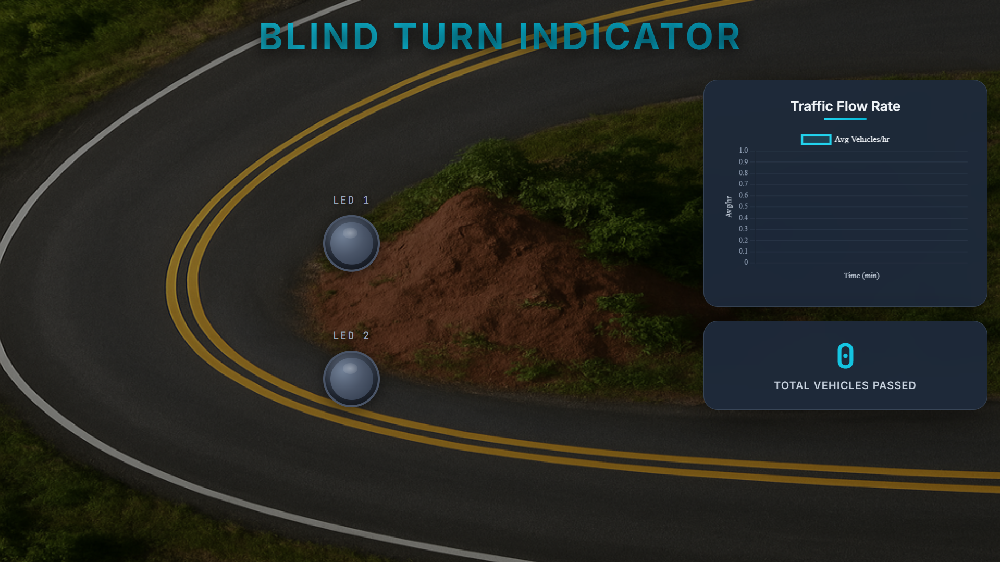

### Blind Turn Indicator — README

---

## 📸 Screenshot



---

### Project Overview
**Blind Turn Indicator** is an IoT traffic-safety system that detects vehicles approaching blind turns using ultrasonic sensors connected to an Arduino Uno and provides local LED alerts plus a real-time web dashboard for remote monitoring and analytics. 

---

### Key Features
- **Real-time vehicle detection** with HC-SR04 ultrasonic sensors and a 100 cm detection threshold.   
- **Local visual alerts** via two LEDs that activate for 2 seconds per detection.   
- **Web dashboard** with live LED status, 3D-style indicators, vehicle counting, and traffic flow graphs using Socket.IO and Chart.js.   
- **Serial-to-Web bridging**: Arduino → Serial → Node.js server → WebSocket clients for instant updates. 

---

### Hardware Components
- **Arduino Uno R3** (main controller)  
- **2 × HC-SR04 ultrasonic sensors** (distance 2–400 cm; optimized for 100 cm)  
- **2 × LEDs** for local indicators  
- **Breadboard, jumper wires, USB cable** for prototyping and serial connection. 

---

### Pin Configuration
**Left Ultrasonic Sensor**: Trigger → **Pin 9**, Echo → **Pin 8**  
**Right Ultrasonic Sensor**: Trigger → **Pin 7**, Echo → **Pin 6**  
**Left LED** → **Digital Pin 2**  
**Right LED** → **Digital Pin 3**. 

---

### Software Components
- **Arduino IDE** for uploading firmware to the Arduino.  
- **Node.js** server using **SerialPort** to read Arduino data and **Socket.IO** to broadcast updates.  
- **Chart.js** and standard **HTML5/CSS3/JavaScript** for the frontend dashboard. 

---

### Quick Setup and Run Guide

#### 1. Hardware Assembly
1. Wire the two HC-SR04 sensors and LEDs to the Arduino according to the Pin Configuration above.   
2. Connect Arduino to the host machine via USB.

#### 2. Arduino Firmware
1. Open the Arduino sketch in **Arduino IDE**.  
2. Configure trigger/echo and LED pins to match the pin mapping.  
3. Upload the sketch to the Arduino.

#### 3. Server Setup
1. Ensure **Node.js** is installed.  
2. In the project folder, install dependencies:
```bash
npm install
```
3. Start the server (default port **3000**):
```bash
node server.js
```
The server listens on HTTP/WebSocket port **3000** and reads serial data at **9600 baud**. 

#### 4. Open Dashboard
- Open a browser and navigate to `http://localhost:3000` to view live LED states, vehicle counts, and charts.

---

### Operation Notes and Parameters
- **Detection logic**: A vehicle is considered present when measured distance < **100 cm**; LED remains active for **2 seconds** per detection cycle.   
- **Sampling rate**: ~**200 ms** for responsive detection.   
- **Serial settings**: **9600 baud** for Arduino ↔ Node.js communication. 

---

### Troubleshooting
- **No serial data**: Confirm Arduino is connected and the correct COM port is configured in `server.js`.  
- **Dashboard not updating**: Verify the Node.js server is running and Socket.IO connections are established.  
- **False triggers**: Adjust sensor mounting or increase the detection threshold debounce/timer logic in the Arduino sketch.

---

### Future Enhancements
- Add support for multiple sensor pairs at different locations
- Implement data logging and historical analytics
- Add mobile responsive design for dashboard
- Integrate notification system for high traffic alerts

---

### Contributing
Contributions are welcome! Feel free to open issues or submit pull requests.

---

### License
This project is open source. Include your preferred license file (e.g., MIT) in the repository root.